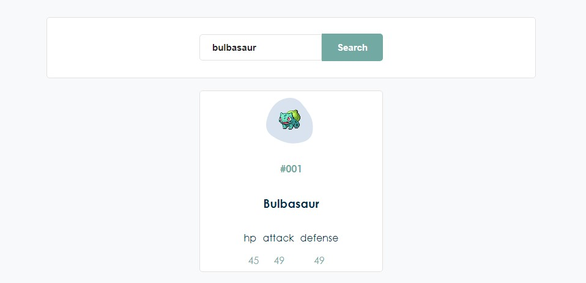

# Challenge 01

You must design a similar page to the following [link](https://medlink.la/doctores)
but using the following api [Pokemon API](https://pokeapi.co/)

#### Requirements

- Mobile friendly
- No frameworks/libraries (boostrap, tailwind or jquery are excluded)
- Use SASS, ES12
- Search and Pagination

You're free to organize your code within this folder.

#### index.html

- tiene un header donde esta el titulo del proyecto
- tiene un main donde tiene un container abajo la caja del filtro
- tiene una clase pokemon-container donde esta siendo insertado dinamicamente por javascript
- por ultimo los botones para la paginación

#### SCSS / SASS

- en el style tiene los estilos generales donde importa header y main.
- incluye mixins y variables
- para compilar sass use prepros pero el ouput de los estilos en css esta en la carpeta public/style.css

#### app.js / javaScript

- en la primera parte esta seleccionando las clases o id con querySelector
- tiene dos variables limit y offset para contar cada cuanto pokemones trae
- para la paginacion tine un boton previous donde tiene un addEventListener - click, para retroceder 9 con las variables limit y offset
- para el boton next hace lo mismo que previous pero suma 9 veces
- tenemos la funcion fetchPokemon donde con fetch traemos el endpoint con un id introducido por nosotros y la data la pasamos a una funcion createPokemon
- en createPokemon estamos creado elementos con javascript para introducirlos al dom dinamicamnete con los pokemones que han llegado
- en la funccion progressBars estamos trayendo los datos de los progresos de cada pokemon
- por ultimo tenemos la funcion removeChildNodes donde cada vez que se cambia de pagina remueve el contenededor para traer nuevos pokemones.

#### bugs / javaScript

- hay un bug en el filter donde hay que insertar toda la palabra para que busque un pokemon y lo pinte.
  ejemplo :

